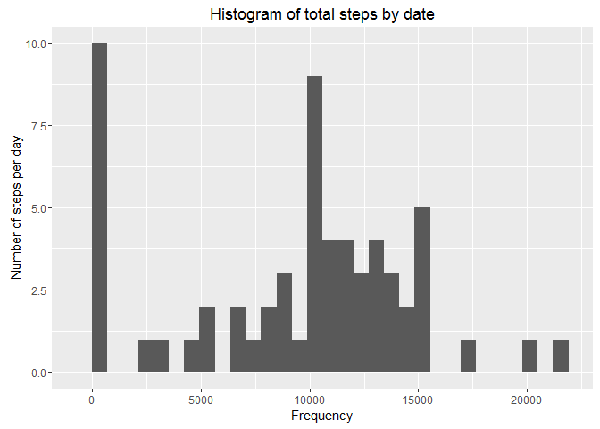
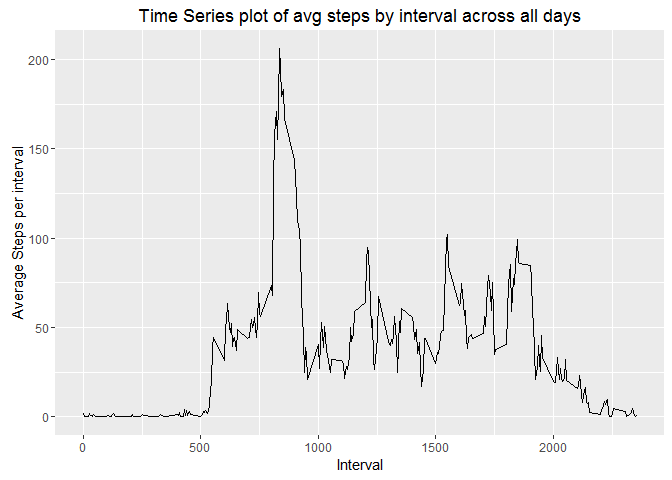
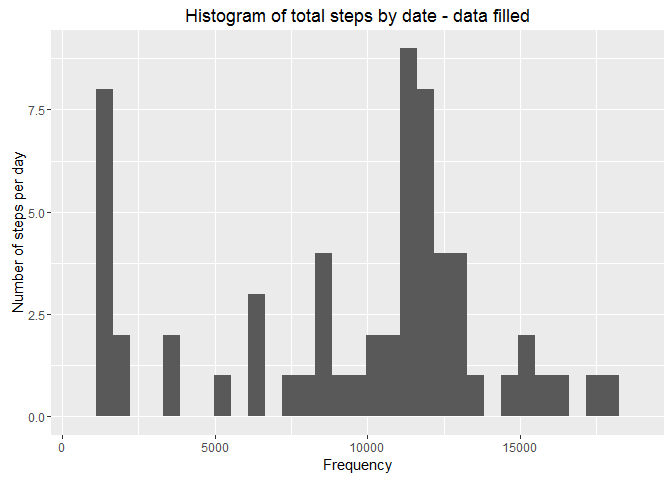
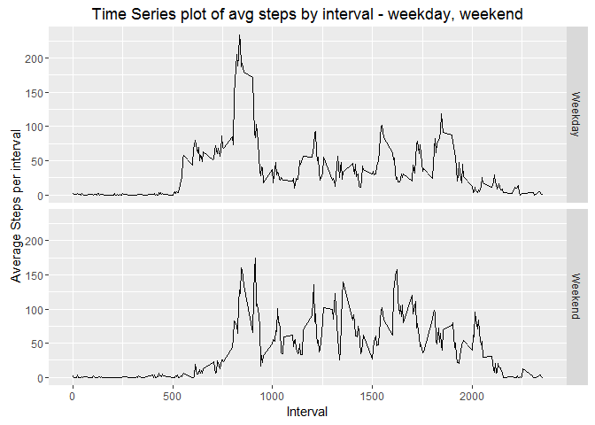

# Reproducible Research: Peer Assessment 1


## Loading and preprocessing the data

```r
if(!file.exists('activity.csv')){
  unzip('repdata-data-activity.zip')
}

data <- read.table("activity.csv", sep = ",", stringsAsFactors=FALSE, header = TRUE, colClasses = c("numeric", "Date", "numeric"))
```

## What is mean total number of steps taken per day?

```r
library(dplyr)
```

```
## Warning: package 'dplyr' was built under R version 3.2.3
```

```
## 
## Attaching package: 'dplyr'
## 
## The following objects are masked from 'package:stats':
## 
##     filter, lag
## 
## The following objects are masked from 'package:base':
## 
##     intersect, setdiff, setequal, union
```

```r
data <- tbl_df(data)
stepsbyDate <- data %>% group_by(date) %>% summarize(dailySteps = sum(steps, na.rm = T))

library(ggplot2)
```

```
## Warning: package 'ggplot2' was built under R version 3.2.3
```

```r
g <- qplot(dailySteps, data = stepsbyDate)
g + labs(title = "Histogram of total steps by date") + xlab("Frequency") + ylab("Number of steps per day")
```

```
## `stat_bin()` using `bins = 30`. Pick better value with `binwidth`.
```

 

```r
#Mean of total steps taken per day: 9354.23
dailymean = mean(stepsbyDate$dailySteps)

#Median of total steps taken per day : 10395
dailymedian = median(stepsbyDate$dailySteps)
```
###Average daily steps is 9354
###Median daily steps is 10395

## What is the average daily activity pattern?

```r
avgstepsbyInterval <- data %>% group_by(interval) %>% summarize(avgIntervalSteps = mean(steps, na.rm = T))
g<- ggplot(data = avgstepsbyInterval, aes(interval, avgIntervalSteps))
g <- g + geom_line()

g + labs(title = "Time Series plot of avg steps by interval across all days") + xlab("Interval") + ylab("Average Steps per interval")
```

 

```r
#Interval on average with maxium number of steps = 835
maxInterval <- avgstepsbyInterval[which.max(avgstepsbyInterval$avgIntervalSteps), "interval"]
```
### On average the the interval with maxium steps across all days is 835

## Imputing missing values

```r
#missing values
x <- complete.cases(data)
table(x)
```

```
## x
## FALSE  TRUE 
##  2304 15264
```

```r
#Number of missing values = 2,304

#Strategy for filling missing value is to replace the missing values with the average steps for that interval
#calculate average steps for each interval across dates
avgstepsbyInterval <- data %>% group_by(interval) %>% summarize(intervalSteps = mean(steps, na.rm = T))


#merge data with avg steps by interval
fillData = merge(data, avgstepsbyInterval, by.x = "interval", by.y = "interval")
#Identify missing steps
n <- is.na(data$steps)

#fill the missing steps with avgstepsbyInterval
fillData$steps[n] <- fillData$intervalSteps[n]

fillstepsbyDate <- fillData %>% group_by(date) %>% summarize(dailySteps = sum(steps, na.rm = T))

g <- qplot(dailySteps, data = fillstepsbyDate)
g + labs(title = "Histogram of total steps by date - data filled") + xlab("Frequency") + ylab("Number of steps per day")
```

```
## `stat_bin()` using `bins = 30`. Pick better value with `binwidth`.
```

 

```r
#Mean of total steps taken per day: 9563.93
fillmean <- mean(fillstepsbyDate$dailySteps)

#Median of total steps taken per day : 11215
fillmedian <- median(fillstepsbyDate$dailySteps)
```

### Number of missing values is 2,304
### Strategy for filling missing values is to fill it with average steps by interval across dates
### Average daily steps after filling missing values is 9563
### Median daily steps after filling missing values is 11215

## Are there differences in activity patterns between weekdays and weekends?

```r
fillData <- mutate(fillData, day = weekdays(date))
wknd <- fillData$day %in% c("Saturday", "Sunday")
fillData$day[wknd] = "Weekend"
fillData$day[!wknd] = "Weekday"

fillavgstepsbyWday <- fillData %>% group_by(day,interval) %>% summarize(dailySteps = mean(steps, na.rm = T))

g<- ggplot(data = fillavgstepsbyWday, aes(interval, dailySteps))
g <- g + geom_line() +facet_grid(day~.)

g + labs(title = "Time Series plot of avg steps by interval - weekday, weekend") + xlab("Interval") + ylab("Average Steps per interval")
```

 
